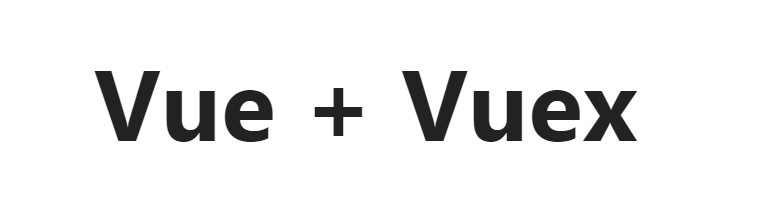

# Vue Vuex

> ***Vuex*** is a perfect state manager of Vue . With vuex , you could manage all your states of your app 

## Store 

**Store** is a store of states .

```bash
import Vue from "vue" ;
import Vuex from "vuex" ;
import countNum from "./modules/countNum" ;
import * as actions from "./actions" ;
Vue.use(Vuex);
export default new Vuex.Store({
	actions ,
	modules : {
		countNum 
	} 
});
```

## Mutation

***Mutation*** is the synchronous trigger of state in vuex . Always remeber that mutation is the **ONLY** way to do that .


```bash
// defination
import * as types from "../mutation-type.js" ;
const mutations = {
	[types.ADD_COUNT](state){
		state.count++ ;
	} ,
	[types.DELETE_COUNT](state){
		state.count-- ;
	} ,
	[types.SHOW_COUNT](state){
		alert(state.count) ;
	}
} ;
```

```bash
// use
addCount(){
	this.$store.commit("ADD_COUNT");
},
```

## Action

**Action** is an object describing a way to change the state . 
```bash
// defination
import * as types from "../mutation-type.js" ;
const actions = {
	getCountNum ({ commit }){
		commit(types.SHOW_COUNT);
	}  ,
	add ({commit}){
		commit(types.ADD_COUNT);
	} ,
	del ({commit}){
		commit(types.DELETE_COUNT);
	}
} ;
```  
```bash
// use
showTotalCount (){
	this.$store.dispatch('getCountNum');
}
```

## View

```bash
<template>
	<div>
		<h1>{{title}}</h1>
		<button class="btn" @click="showTotalCount">actions直接使用</button>
		<button class="btn" @click="getCountNum">mapActions使用</button>
		<br/>
		<br/>
		<button class="btn" @click="addCount">mutation直接使用</button>
		<button class="btn" @click="ADD_COUNT">mapMutations直接使用</button>
		<show-count></show-count>
	</div>
</template>
```

## To See Result

> note : If you would not install all the rely packages , please do it follow [Build Guide](../../README.md) .

```bash
location:3000
```
